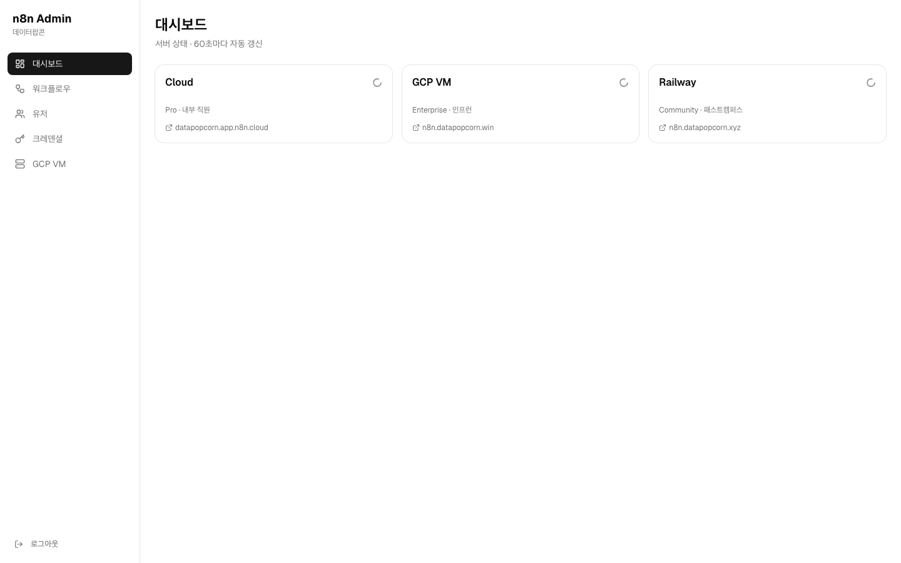
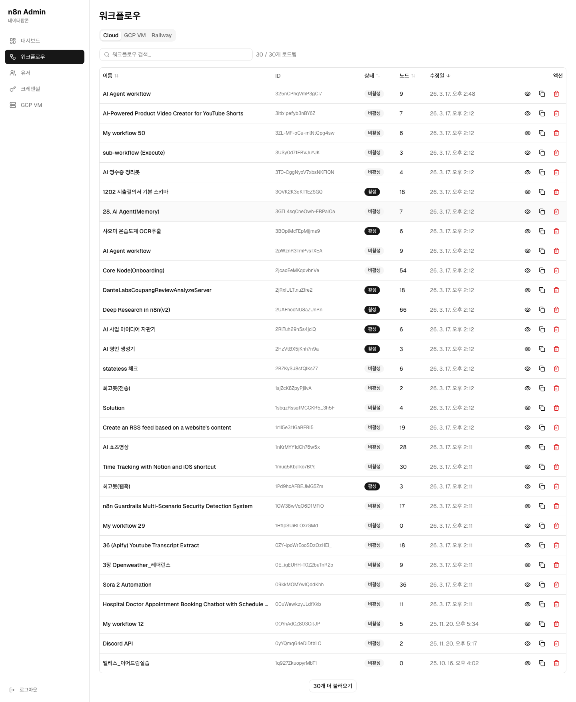
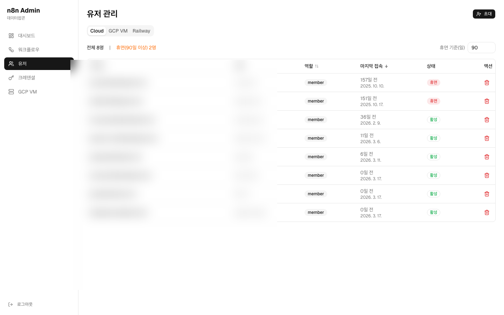
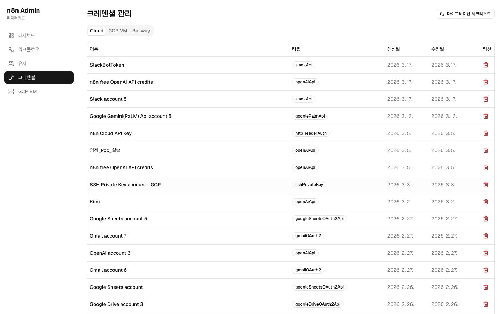
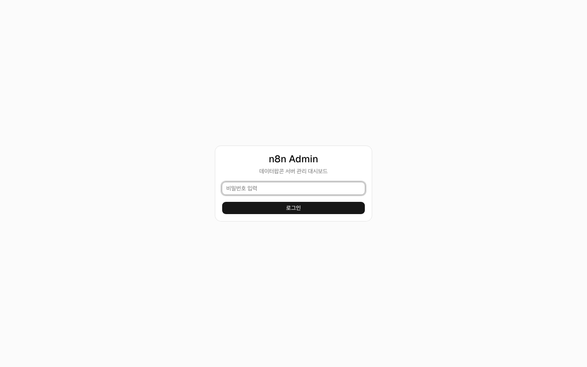

# n8n-admin

n8n 서버를 위한 관리 도구 키트. 워크플로우 백업·복원, 유저 관리, 크레덴셜 관리, 서버 이관 체크리스트, 웹 대시보드를 바로 사용할 수 있습니다.


[](https://vercel.com/new/clone?repository-url=https://github.com/datapopcorn/n8n-admin&env=APP_NAME,SERVER_NAME,SERVER_URL,SERVER_API_KEY,ADMIN_PASSWORD,NEXTAUTH_SECRET,NEXTAUTH_URL&envDescription=환경변수%20설명은%20.env.example을%20참고하세요&envLink=https://github.com/datapopcorn/n8n-admin/blob/main/.env.example)

---

## 미리보기

| 대시보드 | 워크플로우 |
|----------|-----------|
|  |  |

| 유저 관리 | 크레덴셜 |
|-----------|---------|
|  |  |

---

## 포함 기능

| 도구 | 기능 |
|------|------|
| **Shell Scripts** | 워크플로우 export/import, 유저 관리, 크레덴셜 관리, 서버 이관 |
| **Admin 대시보드** | 웹 UI로 서버 상태 모니터링, 워크플로우·유저·크레덴셜 관리 |
| **GCP VM 제어** | VM 시작/중지/재시작/리사이즈 (선택) |

---

## 빠른 시작 — Scripts (5분)

n8n 서버 URL과 API 키만 있으면 바로 시작할 수 있습니다.

```bash
# 1. 레포 clone (또는 우측 상단 "Use this template" 버튼 사용)
git clone https://github.com/datapopcorn/n8n-admin.git
cd n8n-admin

# 2. 환경 설정
cp .env.example .env
# .env 파일을 열어 SERVER_URL과 SERVER_API_KEY 입력

# 3. 의존성 설치 (macOS)
brew install jq
# Ubuntu/Debian: sudo apt install jq

# 4. 워크플로우 백업
./scripts/export.sh server1

# 5. 유저 목록 조회
./scripts/list-users.sh server1
```

---

## Admin 대시보드 배포 (선택)



위 **"Deploy with Vercel"** 버튼을 클릭하면 자동으로:
1. 이 레포를 내 GitHub 계정으로 fork
2. 환경변수 입력 폼 표시
3. Vercel에 배포

상세 가이드: [docs/vercel-deploy.md](docs/vercel-deploy.md)

---

## Desktop App (macOS)

개발 도구 설치 없이 n8n 서버를 관리하고 싶다면 데스크톱 앱을 사용하세요.

### 설치

1. [최신 릴리즈](https://github.com/team-datapopcorn/n8n-admin/releases)에서 `n8n.Admin-1.0.0-arm64.dmg` 다운로드
2. DMG를 열고 `n8n Admin`을 Applications 폴더로 드래그
3. 앱 실행 → 서버 URL과 API 키 입력 → 끝!

> macOS에서 "확인되지 않은 개발자" 경고가 나타나면:
> 시스템 설정 → 개인정보 보호 및 보안 → "그래도 열기" 클릭

### 직접 빌드

```bash
# 의존성 설치
npm install
cd admin && pnpm install && cd ..

# DMG 빌드
./scripts/build-desktop.sh
# dist/ 폴더에 DMG 파일이 생성됩니다
```

---

## 서버 추가

`.env`에 서버 항목을 추가하고 `scripts/_common.sh`에도 case를 추가합니다.

```bash
# .env에 추가
SERVER2_NAME=Backup Server
SERVER2_URL=https://your-second-n8n.com
SERVER2_API_KEY=your_second_api_key
```

```bash
# scripts/_common.sh의 case 블록에 추가
server2) N8N_URL="${SERVER2_URL:-}"; API_KEY="${SERVER2_API_KEY:-}" ;;
```

> ⚠️ 서버 번호는 연속해야 합니다 (server2 없이 server3만 있으면 무시됩니다).

---

## Scripts 전체 목록

| 스크립트 | 설명 | 사용법 |
|----------|------|--------|
| `export.sh` | 워크플로우 JSON 백업 | `./scripts/export.sh server1` |
| `import.sh` | 워크플로우 복원/배포 | `./scripts/import.sh server1 server1/workflows/My_Workflow.json` |
| `list-users.sh` | 유저 목록 / 휴면 탐지 | `./scripts/list-users.sh server1 --dormant 90` |
| `cleanup-users.sh` | 휴면 유저 삭제 | `./scripts/cleanup-users.sh server1 --dormant 180 --dry-run` |
| `invite-users.sh` | 유저 초대 | `./scripts/invite-users.sh server1 user@example.com` |
| `list-credentials.sh` | 크레덴셜 목록 | `./scripts/list-credentials.sh server1` |
| `delete-credential.sh` | 크레덴셜 삭제 | `./scripts/delete-credential.sh server1 abc123` |
| `cleanup-workflows.sh` | 중복/불필요 워크플로우 정리 | `./scripts/cleanup-workflows.sh server1 --execute` |
| `migration-checklist.sh` | 서버 이관 체크리스트 | `./scripts/migration-checklist.sh server1 server2` |
| `gcp-vm.sh` | GCP VM 제어 | `./scripts/gcp-vm.sh status` |

---

## GCP VM 관리 (선택)

GCP VM에 n8n을 올린 경우 VM을 직접 제어할 수 있습니다.
설정 가이드: [docs/gcp-setup.md](docs/gcp-setup.md)

---

## 요구사항

- **Shell Scripts:** bash, jq
- **Admin 대시보드:** Node.js 20+, pnpm
